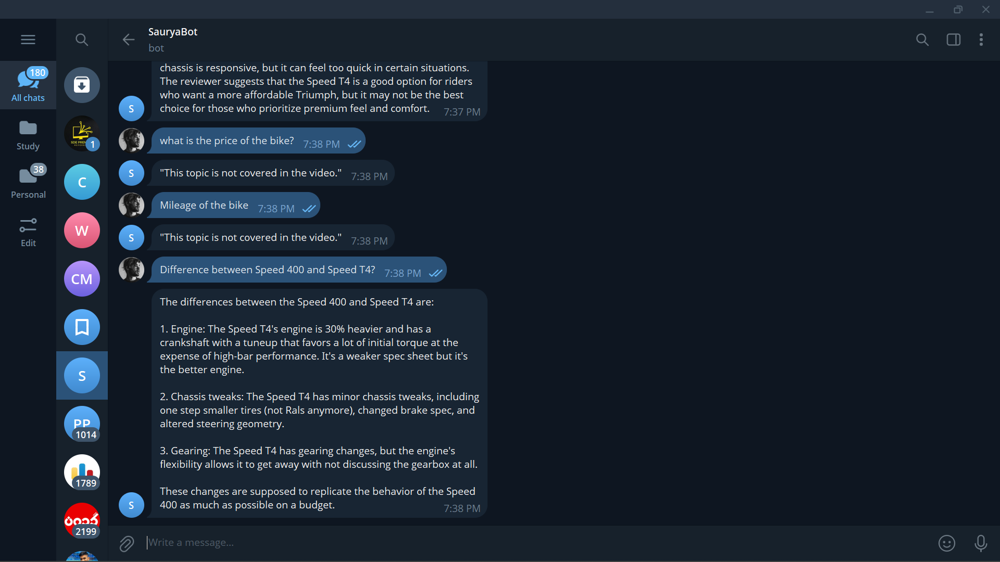
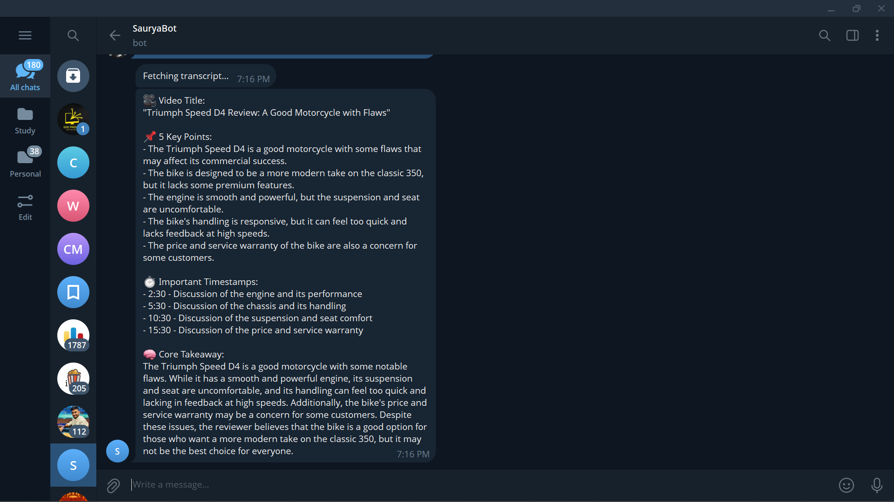

# Telegram YouTube Summarizer & Q&A Bot

An AI-powered Telegram bot that summarizes YouTube videos and enables users to ask contextual questions about video content.  
The bot acts as a personal AI research assistant for YouTube, helping users quickly extract key insights and consume long-form video content efficiently.

---

## 🚀 Features

- Accepts YouTube video links
- Fetches video transcripts automatically
- Generates clear, structured summaries
- Allows follow-up contextual Q&A
- Multi-language support:
  - English (default)
  - Hindi
- Handles invalid links, missing transcripts, and long videos gracefully
- Supports multiple users simultaneously

---

## 📌 User Flow

### Step 1 — Send YouTube Link
User:

### Step 2 — Ask Questions
User:
What did he say about pricing?
Bot:
Answers clearly using video context
If not found:
This topic is not covered in the video.

### Step 3 — Multi-language
User:

Summarize in Hindi
Explain in Hindi

---

## 🏗 Architecture

Telegram User
|
Telegram Bot (python-telegram-bot)
|
Transcript Service (youtube-transcript-api)
|
Prompt Engine
|
Groq LLM (Llama-3.1-8B-Instant)
|
Telegram Response

### Key Components

- `bot.py` – Telegram interface and routing
- `utils.py` – YouTube transcript extraction
- `summarizer.py` – Structured summarization
- `qa.py` – Grounded Q&A
- `groq_client.py` – LLM client
- `.env` – Secrets

---

## 🧠 Design Decisions

### Session Management
- In-memory dictionary maps `chat_id → transcript`
- Lightweight and fast
- Suitable for small-to-medium scale

### Context Handling
- Entire transcript trimmed to 12,000 characters
- Avoids token overflow
- Keeps answers grounded

### No Embeddings / Vector DB
- Prompt-grounding sufficient for single-video scope
- Reduces system complexity

### Language Support
- Keyword-based detection (`hindi`)
- Prompt-level multilingual generation

---

## ⚖ Trade-offs

| Choice | Reason |
|------|-------|
| In-memory storage | Simplicity |
| No vector DB | Cost & setup overhead avoided |
| Prompt grounding | Faster than embedding search |
| Groq LLM | Free tier + fast inference |

---

## 🧩 Error Handling

- Invalid YouTube URL → Friendly message
- No transcript available → Fallback message
- Model failure → Graceful retry prompt
- Very long videos → Transcript trimmed
- Network timeout → Telegram timeout increased

---

## 🛠 Setup Instructions

### 1. Clone Repository

git clone <repo_url>
cd YT_TG_Bot

### 2. Create Virtual Environment
python -m venv venv
venv\Scripts\activate   # Windows

### 3. Install Dependencies
pip install -r requirements.txt

### 4. Create .env
BOT_TOKEN=your_telegram_bot_token
GROQ_API_KEY=your_groq_api_key
### 5. Run Bot

python bot.py

### requirements.txt
python-telegram-bot==20.7
youtube-transcript-api
python-dotenv
groq
requests

## 📸 Screenshots

### Bot Start

### Video Summary

### Ask Question

### Answer

